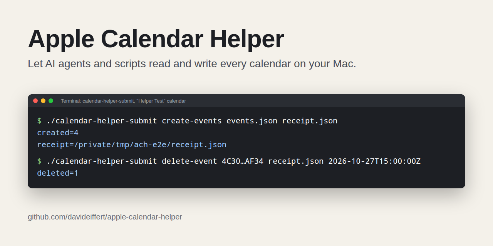
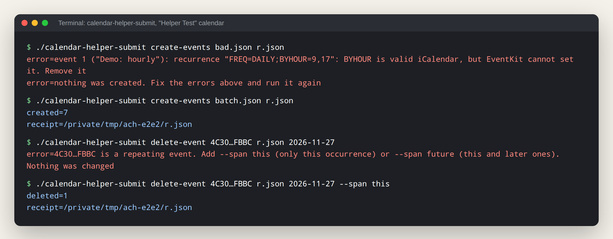

# Apple Calendar Helper

Let your AI agents use the calendars already on your Mac.

Ask your agent what next week looks like, or ask it to add or move an event. Apple Calendar Helper gives local agents and scripts a way to read and change events through a small background app with macOS calendar permission.



*How it works. This graphic is an illustration, not an app screenshot.*

iCloud's CalDAV API covers iCloud calendars. Apple's EventKit API sees the accounts in Calendar on your Mac, but it needs calendar permission. The helper holds that permission and accepts commands through local files. It has no hosted service or separate calendar account. Read-only calendars stay read-only.

## Try it

Needs a Mac and the Xcode command line tools (`xcode-select --install`). This release builds from source; it does not include a downloadable app.

```bash
git clone https://github.com/davideiffert/apple-calendar-helper
cd apple-calendar-helper
./build.sh
open "build/Apple Calendar Helper.app"
./calendar-helper-submit list-calendars
```

The first launch shows the calendar permission prompt on the Mac's screen. Approve calendar access there. `list-calendars` waits for that, then prints each account, calendar name, and ID. After the first launch, `open -a "Apple Calendar Helper"` starts it from anywhere.

### Read the next seven days

Use an account name from `list-calendars`. This example reads every calendar in the `iCloud` account, from today up to the same day next week, and writes `events.json`. It does not change any events.

```bash
./calendar-helper-submit dump-events "iCloud" '*' \
  "$(date +%F)" "$(date -v+7d +%F)" events.json
python3 -m json.tool events.json
```

The date commands above are for macOS. To read another account, replace `iCloud` with its name. Repeat for each account you want included.

### Give it to your agent

Open this checkout in your agent and give it a task like:

> Read this repository's AGENTS.md. Use calendar-helper-submit to list the accounts, then read the next seven days from each account and summarize my week. Use only list-calendars and dump-events. Do not change events.

The agent needs to run on this Mac or reach it over SSH. The helper must already be running and have calendar permission. It executes submitted commands without asking before each change. [AGENTS.md](AGENTS.md) tells the agent to change events only when you requested that change.

## How it works

1. The helper runs in the background with calendar access and watches a folder.
2. `calendar-helper-submit` drops a JSON command into that folder and waits for the answer.
3. The helper runs the command through EventKit and writes the result back.

The folder is `~/Library/Application Support/apple-calendar-helper/`. To use a different one, set `CALENDAR_HELPER_HOME` for the submit script and start the helper with `open --env CALENDAR_HELPER_HOME=/your/folder "build/Apple Calendar Helper.app"`.

The helper has no window or Dock icon. To stop it, run `pkill -x calendar-helper`. To keep it running after a reboot, add `Apple Calendar Helper.app` to System Settings > General > Login Items. Copy it to `/Applications` first if you plan to delete the build folder.

To call the submit script from anywhere, link it onto your PATH, for example `ln -s "$PWD/calendar-helper-submit" /usr/local/bin/`.

Point your agent at [AGENTS.md](AGENTS.md) for the short version.

## Commands

| Command | Arguments | Changes calendars |
|---|---|---|
| `list-calendars` | none | No |
| `dump-events` | `<account> <calendar> <start yyyy-mm-dd> <end yyyy-mm-dd> <output.json>` | No |
| `create-events` | `<input.json> <receipt.json>` | Yes |
| `update-event` | `<input.json> <receipt.json>` | Yes |
| `delete-event` | `<event-id> <receipt.json> [occurrence-start] [--span this\|future]` | Yes |

- `<account>` is the account name from `list-calendars`, such as `iCloud`. `<calendar>` is a calendar name or its ID. Use the ID when two calendars share a name. `dump-events` also accepts `'*'` (quoted) for every calendar in the account.
- `dump-events` includes the start date and stops before the end date. It covers at most 4 years per call, which is EventKit's limit.
- Relative file paths are resolved from the directory you ran the command in.
- Write commands check that the receipt file can be written before they change anything, without touching an existing receipt. The receipt records what changed.

### Events in and out

`dump-events` writes each event with the same field names and formats that `create-events` and `update-event` read:

```json
{
  "eventIdentifier": "4C30...:1ECC...",
  "calendarIdentifier": "4C30...",
  "sourceTitle": "iCloud",
  "calendarTitle": "Work",
  "title": "Planning",
  "startDate": "2026-10-06T16:00:00Z",
  "endDate": "2026-10-06T17:00:00Z",
  "isAllDay": false,
  "timeZone": "America/Denver",
  "recurrence": "FREQ=MONTHLY;BYDAY=3WE",
  "location": null,
  "notes": null,
  "url": null
}
```

- **To edit**, copy the fields you want to change from the dump into `update-event`'s `changes`, edited. Sending a field back unchanged is fine, including `recurrence`.
- **To copy**, pass a dumped event to `create-events` as it is. Its `calendarIdentifier` picks the calendar and its `eventIdentifier` is ignored.
- **Timed events** take ISO 8601 times. A time with `Z` or an offset is exact. A time without one, like `2026-10-06T09:00:00`, is read in `timeZone`, or in the Mac's zone if `timeZone` is not set. `timeZone` is an IANA name like `America/New_York`, or `null` for a floating event that keeps the same clock time in any zone. Repeats keep their local time across daylight saving changes.
- **All-day events** take `yyyy-mm-dd` dates with an exclusive end, so a one-day event on October 6 ends `2026-10-07`.
- **Repeating events** share one `eventIdentifier` across every occurrence. Each occurrence's `startDate` tells them apart.

### Repeating events

`recurrence` is an iCalendar RRULE ([RFC 5545](https://www.rfc-editor.org/rfc/rfc5545#section-3.3.10)), with or without the `RRULE:` prefix, or one of the words `daily`, `weekly`, `monthly`, `yearly`.

| Rule | Meaning |
|---|---|
| `weekly` | Every week on the start date's weekday |
| `FREQ=WEEKLY;INTERVAL=2;BYDAY=TU,TH` | Every other Tuesday and Thursday |
| `FREQ=MONTHLY;BYDAY=3WE` | Third Wednesday of every month |
| `FREQ=MONTHLY;BYDAY=-1FR` | Last Friday of every month |
| `FREQ=MONTHLY;BYDAY=MO,TU,WE,TH,FR;BYSETPOS=-1` | Last weekday of every month |
| `FREQ=YEARLY;BYMONTH=11;BYDAY=4TH` | US Thanksgiving |
| `FREQ=DAILY;COUNT=10` | Ten days in a row |
| `FREQ=WEEKLY;UNTIL=20261231` | Weekly through December 31 |

Supported parts are FREQ (DAILY, WEEKLY, MONTHLY, YEARLY), INTERVAL, BYDAY, BYMONTHDAY, BYMONTH, BYYEARDAY, BYWEEKNO, BYSETPOS, and COUNT or UNTIL. Leave out both for a repeat with no end. UNTIL can be a date (`20261231`, which includes that whole day), a UTC time (`20261231T235959Z`), or a local time (`20261231T235959`). `dump-events` prints a date for all-day events and a UTC time otherwise. EventKit can't store BYHOUR, BYMINUTE, BYSECOND, or HOURLY and faster rules, and it always starts weeks on Monday, so WKST=MO is accepted and other WKST values are not. A rule from another app with a different week start shows it in `dump-events`, and sending it back unchanged is fine. It also only allows BYMONTHDAY with MONTHLY, and BYMONTH, BYWEEKNO, and BYYEARDAY with YEARLY. A rule outside those limits is rejected with the part that failed, and nothing is saved.

### create-events

Takes a JSON array. Every event is checked first. If any is invalid, none are created.

```json
[
  {
    "sourceTitle": "iCloud",
    "calendarTitle": "Work",
    "title": "Planning",
    "startDate": "2026-10-21T09:00:00",
    "endDate": "2026-10-21T10:00:00",
    "timeZone": "America/Denver",
    "recurrence": "FREQ=MONTHLY;BYDAY=3WE"
  },
  {
    "sourceTitle": "iCloud",
    "calendarTitle": "Work",
    "title": "Conference",
    "startDate": "2026-11-02",
    "endDate": "2026-11-05",
    "isAllDay": true
  }
]
```

Required: `title`, `startDate`, `endDate`, and the calendar, as `calendarIdentifier` or as `sourceTitle` plus `calendarTitle` (a name or calendar ID). Optional: `isAllDay` (default false), `timeZone`, `recurrence`, `location`, `notes`, `url`.

### update-event

Takes one JSON object: which event, and what to change.

```json
{
  "eventIdentifier": "4C30...:1ECC...",
  "occurrenceStart": "2026-10-21T15:00:00Z",
  "span": "future",
  "changes": {
    "startDate": "2026-10-21T10:00:00",
    "recurrence": "FREQ=MONTHLY;BYDAY=-1FR",
    "calendar": { "sourceTitle": "iCloud", "calendarTitle": "Personal" }
  }
}
```

- For a repeating event, `occurrenceStart` (the occurrence's `startDate` from `dump-events`) and `span` are required. `span` is `this` for only that occurrence, or `future` for that occurrence and later ones.
- `changes` can hold `title`, `startDate`, `endDate`, `isAllDay`, `timeZone`, `recurrence`, `location`, `notes`, `url`, and `calendar`.
- Changing only `startDate` keeps the event's length. Switching `isAllDay` needs both dates.
- `recurrence: null` stops the repeat. Recurrence changes need `"span": "future"`.
- `calendar` moves the event. It takes a calendar ID or `{ "sourceTitle", "calendarTitle" }`.
- The output prints the event's ID after the change as `eventIdentifier=`, and the receipt saves it. Use that ID afterward: a single changed occurrence gets its own ID, ending in `/RID=...`.
- `null` clears `location`, `notes`, or `url`, and makes `timeZone` floating. `title`, `startDate`, `endDate`, and `isAllDay` can't be null.

Everything is checked before saving. The receipt holds the event before and after.

### delete-event

```bash
./calendar-helper-submit delete-event "<event-id>" receipt.json
./calendar-helper-submit delete-event "<event-id>" receipt.json 2026-10-21T15:00:00Z --span this
./calendar-helper-submit delete-event "<event-id>" receipt.json 2026-10-21T15:00:00Z --span future
```

A repeating event needs the occurrence's start and a span. `--span future` from the first occurrence deletes the whole series.

## When something goes wrong

This output from a throwaway test calendar shows invalid input creating nothing, a corrected batch creating seven events, and a repeating-event deletion requiring an explicit span. Event IDs are shortened for readability.



Results print as `key=value` lines (`list-calendars` prints one tab-separated row per calendar). Failures exit non-zero and say what to do next:

```
error=calendar not found: iCloud/Wrok. Run list-calendars to see account and calendar names
error=the helper is not running. Start it with: open -a "Apple Calendar Helper"
error=event 0 ("Planning"): missing field "endDate"
error=nothing was created. Fix the errors above and run it again
```

If a command times out, the message says whether it ran. A command the helper had already picked up may have changed the calendar, so check with `dump-events` before retrying. The helper's own state is in `status.json` and `last-run.txt` in its folder.

## Limits

- macOS only, and the helper has to be running.
- Any process running as your user can drop a command in the folder. That is the same trust as your user account, but it means a misbehaving script can change your calendar.
- The build uses an ad-hoc signature, so macOS treats every rebuild as a new app and asks for calendar permission again. If you click Don't Allow, macOS will not ask again on its own. Run `tccutil reset Calendar io.github.davideiffert.apple-calendar-helper`, then `open -a "Apple Calendar Helper"` and click Allow. Set `SIGN_IDENTITY` to your own signing certificate to keep permission across rebuilds.
- Commands run one at a time, about one per second.
- Recurrence covers what EventKit can store, listed above. An event with more than one rule shows only the first.
- No attendees, alarms, or reminders.
- Tested on macOS 26 on Apple silicon against throwaway iCloud calendars, including repeating events across a daylight saving change.

## Status

Maintained. Issues and pull requests are welcome.

## Contributing

Bug reports and small fixes are welcome. Please run the tests before opening a pull request, and test calendar changes against a throwaway calendar.

## Development

```bash
./build.sh   # macOS only
./test.sh    # command script tests anywhere; RRULE parser tests wherever swiftc exists
```

GitHub Actions builds the app on macOS and runs both test suites. The calendar commands need a Mac with calendar access, so they are tested by hand against a throwaway calendar. See [CHANGELOG.md](CHANGELOG.md).

## License

MIT
